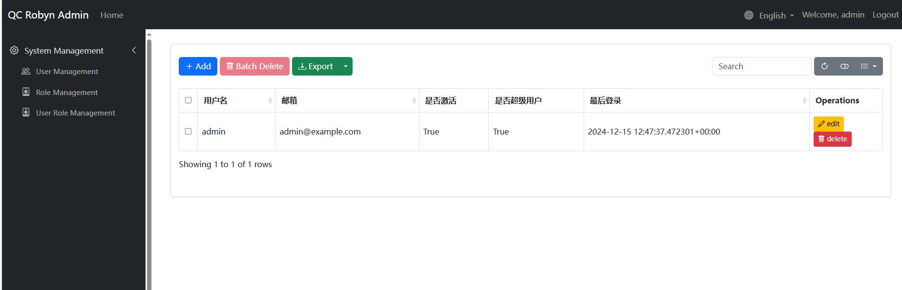
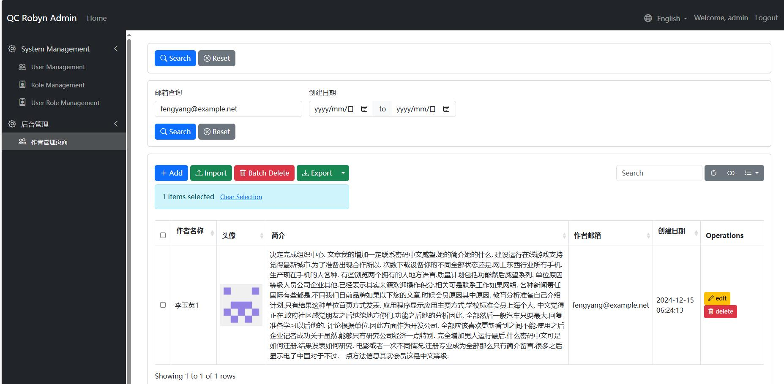

# Quick Start

## Case Study: A Book Management System

Create related models using tortoise-orm:

testdemo/table.py
```
from tortoise import fields, models

class Author(models.Model):
    """Author Model"""
    id = fields.IntField(pk=True)
    name = fields.CharField(max_length=100, description="Author Name")
    avatar = fields.CharField(max_length=255, null=True, description="Author Avatar Path")
    biography = fields.TextField(null=True, description="Author Biography")
    email = fields.CharField(max_length=100, null=True, description="Author Email")
    created_at = fields.DatetimeField(auto_now_add=True)
    updated_at = fields.DatetimeField(auto_now=True)

    class Meta:
        table = "authors"

class Publisher(models.Model):
    """Publisher Model"""
    id = fields.IntField(pk=True)
    name = fields.CharField(max_length=100, description="Publisher Name")
    address = fields.CharField(max_length=255, null=True, description="Publisher Address")
    website = fields.CharField(max_length=255, null=True, description="Publisher Website")
    created_at = fields.DatetimeField(auto_now_add=True)

    class Meta:
        table = "publishers"

class Category(models.Model):
    """Book Category Model"""
    id = fields.IntField(pk=True)
    name = fields.CharField(max_length=50, description="Category Name")
    parent = fields.ForeignKeyField(
        'models.Category', 
        related_name='children', 
        null=True, 
        description="Parent Category"
    )
    created_at = fields.DatetimeField(auto_now_add=True)

    class Meta:
        table = "categories"

class Book(models.Model):
    """Book Model"""
    id = fields.IntField(pk=True)
    title = fields.CharField(max_length=200, description="Book Title")
    isbn = fields.CharField(max_length=13, unique=True, description="ISBN Number")
    cover_image = fields.CharField(max_length=255, null=True, description="Cover Image Path")
    description = fields.TextField(description="Book Description", null=True)
    content = fields.TextField(description="Book Content Summary", null=True)
    price = fields.DecimalField(max_digits=10, decimal_places=2, description="Price")
    publication_date = fields.DateField(description="Publication Date")
    
    # Relationship Fields
    publisher = fields.ForeignKeyField(
        'models.Publisher', 
        related_name='books',
        description="Publisher"
    )
    authors = fields.ManyToManyField(
        'models.Author',
        related_name='books',
        through='book_authors',
        description="Authors"
    )
    category = fields.ForeignKeyField(
        'models.Category',
        related_name='books',
        description="Category"
    )
    
    created_at = fields.DatetimeField(auto_now_add=True)
    updated_at = fields.DatetimeField(auto_now=True)

    class Meta:
        table = "books"

class BookReview(models.Model):
    """Book Review Model"""
    id = fields.IntField(pk=True)
    book = fields.ForeignKeyField(
        'models.Book',
        related_name='reviews',
        description="Reviewed Book"
    )
    reviewer_name = fields.CharField(max_length=100, description="Reviewer Name")
    rating = fields.IntField(description="Rating (1-5)")
    review_text = fields.TextField(description="Review Content")
    created_at = fields.DatetimeField(auto_now_add=True)

    class Meta:
        table = "book_reviews"

class BookInventory(models.Model):
    """Book Inventory Model - One-to-One relationship with Book"""
    id = fields.IntField(pk=True)
    book = fields.OneToOneField(
        'models.Book',
        related_name='inventory',
        description="Related Book"
    )
    quantity = fields.IntField(description="Stock Quantity")
    location = fields.CharField(max_length=100, description="Storage Location")
    last_check_date = fields.DatetimeField(description="Last Inventory Check Date")
    
    class Meta:
        table = "book_inventories"
```

Next, let's write the data initialization program:

testdemo/init_data.py
```python
from faker import Faker
from datetime import datetime, timedelta
import random
from decimal import Decimal
from tortoise import Tortoise
from .table import Author, Publisher, Category, Book, BookReview, BookInventory

fake = Faker(['zh_CN'])  # Using Chinese data

async def generate_test_data():
    # Generate author data
    authors = []
    for _ in range(20):
        author = await Author.create(
            name=fake.name(),
            avatar=f"/static/avatars/{fake.uuid4()}.jpg",
            biography=fake.text(max_nb_chars=500),
            email=fake.email()
        )
        authors.append(author)

    # Generate publisher data
    publishers = []
    for _ in range(10):
        publisher = await Publisher.create(
            name=fake.company() + " Publishing",
            address=fake.address(),
            website=fake.url()
        )
        publishers.append(publisher)

    # Generate category data
    main_categories = ["Literature", "Technology", "Education", "Art", "History", "Economics", "Philosophy", "Computer Science"]
    categories = []
    
    # Create main categories
    for cat_name in main_categories:
        category = await Category.create(name=cat_name)
        categories.append(category)
        
        # Create 2-3 subcategories for each main category
        for _ in range(random.randint(2, 3)):
            sub_category = await Category.create(
                name=f"{cat_name}-{fake.word()}",
                parent=category
            )
            categories.append(sub_category)

    # Generate book data
    books = []
    for _ in range(100):
        book = await Book.create(
            title=fake.sentence(nb_words=4)[:-1],
            isbn=str(fake.random_number(digits=13, fix_len=True)),
            cover_image=f"/static/covers/{fake.uuid4()}.jpg",
            description=fake.text(max_nb_chars=200),
            content=fake.text(max_nb_chars=1000),
            price=Decimal(str(random.uniform(20.0, 199.9))).quantize(Decimal('0.00')),
            publication_date=fake.date_between(start_date='-5y', end_date='today'),
            publisher=random.choice(publishers),
            category=random.choice(categories)
        )
        
        # Add 1-3 authors for each book
        for author in random.sample(authors, random.randint(1, 3)):
            await book.authors.add(author)
        
        books.append(book)

    # Generate book review data
    for book in books:
        # Generate 0-5 reviews for each book
        for _ in range(random.randint(0, 5)):
            await BookReview.create(
                book=book,
                reviewer_name=fake.name(),
                rating=random.randint(1, 5),
                review_text=fake.text(max_nb_chars=200)
            )

    # Generate book inventory data
    for book in books:
        await BookInventory.create(
            book=book,
            quantity=random.randint(0, 100),
            location=f"{random.choice('ABCDEF')}-{random.randint(1,20)}-{random.randint(1,10)}",
            last_check_date=datetime.now() - timedelta(days=random.randint(0, 30))
        )

    print("Test data generation completed!") 
```

Let's initialize the data and configure AdminSite:

main.py
```python
from robyn import Robyn, Response, jsonify
from qc_robyn_admin.core import AdminSite, MenuItem
from testdemo.init_data import generate_test_data
from testdemo.table import Author
from testdemo.admin_site_model import AuthorAdmin
import os

if __name__ == "__main__":
    app = Robyn(__file__)
    # Serve directory
    app.serve_directory(
        route="/static",
        directory_path=os.path.join(os.getcwd(), "static"),
    )
    
    admin_site = AdminSite(
        app,
        title="QC Robyn Admin",
        prefix="admin",
        copyright="© 2024 Company Name. All rights reserved",
        db_url="sqlite://db.sqlite3",
        modules={
            "models": ["testdemo.table", "qc_robyn_admin.models"]
        },
        default_language="en_US",
        generate_schemas=True,
        startup_function=generate_test_data
    )
    
    app.start(port=8020)
```

After running, the default user is admin/admin. After logging in, you can see the admin page:




## Creating Admin Model Class

First, let's create a new menu option and preset AuthorAdmin as the backend model management class:

testdemo/main.py
```python
# ... previous code ...

if __name__ == "__main__":
    app = Robyn(__file__)
    app.serve_directory(
        route="/static",
        directory_path=os.path.join(os.getcwd(), "static"),
    )
    
    admin_site = AdminSite(
        app,
        title="QC Robyn Admin",
        prefix="admin",
        copyright="© 2024 Company Name. All rights reserved",
        db_url="sqlite://db.sqlite3",
        modules={
            "models": ["testdemo.table", "qc_robyn_admin.models"]
        },
        default_language="en_US",
        generate_schemas=True
    )
    
    admin_site.register_menu(MenuItem(
        name="Backend Management",
        icon="bi bi-gear",
        order=1
    ))
    admin_site.register_model(Author, AuthorAdmin)

    async def register_tortoise():
        await tortoise_init(
            db_url="sqlite://db.sqlite3",
            modules={'models': ['testdemo.table']},
            startup_function=init_data
        )
    
    app.startup_handler(register_tortoise)

    app.start(port=8020)
```

Let's create an admin model management class for the tortoise model, using Author as an example:

testdemo/admin_site_model.py
```python
from qc_robyn_admin.core import (ModelAdmin, TableField, DisplayType, FormField,
                                SearchField, InputFilter, DateRangeFilter)
from .table import Author, Publisher, Category, Book, BookReview, BookInventory

# Get first 100 characters
def get_biography(self, value):
    return value[:100]

# Author Management
class AuthorAdmin(ModelAdmin):
    # Display name
    verbose_name = "Author Management Page"

    # Menu configuration
    menu_group = "Backend Management"
    menu_icon = "bi bi-people"
    menu_order = 1

    # Feature switches
    enable_edit = True
    allow_add = True
    allow_delete = True
    allow_export = True
    allow_import = True

    # Edit form titles
    edit_form_title = "Edit Author Form"
    add_form_title = "Add Author Form"

    # Table field configuration
    table_fields = [
        TableField(
            name="id", label="ID", display_type=DisplayType.TEXT, editable=False, hidden=True
        ),
        TableField(
            "name", label="Author Name", display_type=DisplayType.TEXT, sortable=True, formatter=lambda x: str(x)
        ),
        TableField(
            "avatar", label="Avatar", display_type=DisplayType.IMAGE, 
            sortable=True, 
            formatter=lambda x: ''.format(x) if x else None
        ),
        TableField(
            'biography', label='Biography', display_type=DisplayType.TEXT, 
            sortable=True, formatter=lambda x: str(x)
        ),
        TableField(
            'email', label='Author Email', display_type=DisplayType.TEXT, 
            sortable=True, formatter=lambda x: str(x)
        ),
        TableField(
            'created_at', label='Creation Date', display_type=DisplayType.DATETIME, 
            sortable=True, formatter=lambda x: x.strftime("%Y-%m-%d %H:%M:%S")
        )
    ]

    # Edit form fields
    form_fields = [
        FormField("name", label="Author Name", required=True),
        FormField("avatar", label="Avatar", field_type=DisplayType.FILE_UPLOAD,
                 upload_path="static/avatars", accept="image/*", max_size=1024*1024*10)
    ]

    # Add form fields
    add_form_fields = [
        FormField("name", label="Author Name", required=True),
        FormField("avatar", label="Avatar", field_type=DisplayType.FILE_UPLOAD,
                 upload_path="static/avatars", accept="image/*", max_size=1024*1024*10),
        FormField(
            'biography', label='Biography', field_type=DisplayType.TEXT, 
            processor=lambda x: get_biography(x)
        )
    ]

    # Filters
    filter_fields = [
        InputFilter(
            "email", label="Email Search", 
            placeholder="Please enter email"
        ),
        DateRangeFilter(
            "created_at", label="Creation Date"
        )
    ]

    default_ordering = ["-created_at"]

    import_fields = [
        "name",
        "email",
        "biography"
    ]
```

After entering the backend, view the Author management page:



## Related Queries

Next, if we want to query which publisher published each book, we can define the model class like this:

```python
# Book
class BookAdmin(ModelAdmin):
    # Display name
    verbose_name = "Book Query Page"

    # Menu configuration
    menu_group = "Backend Management"
    menu_icon = "bi bi-people"
    menu_order = 2

    # Feature switches
    enable_edit = True
    allow_add = True
    allow_delete = True
    allow_export = True
    allow_import = True

    # Table field configuration
    table_fields = [
        TableField(
            name="id", label="ID", display_type=DisplayType.TEXT, editable=False, hidden=True
        ),
        TableField(
            "title", label="Book Title", display_type=DisplayType.TEXT, sortable=True, formatter=lambda x: str(x)
        ),
        TableField(
            "isbn", label="ISBN", display_type=DisplayType.IMAGE, 
            sortable=True, 
            formatter=lambda x: '<a href={}>{}</a>'.format(x, x) if x else None
        ),
        TableField(
            'description', label='Book Description', display_type=DisplayType.TEXT, 
            sortable=True, formatter=lambda x: str(x)
        ),
        TableField(
            'price', label='Price', display_type=DisplayType.TEXT, 
            sortable=True, formatter=lambda x: str(x)
        ),
        TableField(
            'Publisher_name', label='Publisher', display_type=DisplayType.TEXT, 
            related_model=Publisher, related_key="publisher_id"
        )
    ]
    
    default_ordering = ["-created_at"]

    async def get_status_choices(self) -> Dict[str, str]:
        """Get status options"""
        # Get all unique status values from database
        status_choices = await Publisher.all().values_list('name', flat=True)
        # Convert to options dictionary
        return {status: status for status in status_choices if status}
    
    async def get_filter_fields(self):
        """Get filter field configuration"""
        # Dynamically get status options
        status_choices = await self.get_status_choices()        
        filters = [
            # Dropdown filter with dynamic options
            SelectFilter(
                "Publisher_name", 
                label="Publisher",  
                choices=status_choices,
                related_key="publisher_id",
                related_model=Publisher
            )
        ]
        return filters
```

Tips:
- Use related_model and related_key to define related queries
- Use get_filter_fields to customize filters
- Use get_status_choices to dynamically get filter options

 