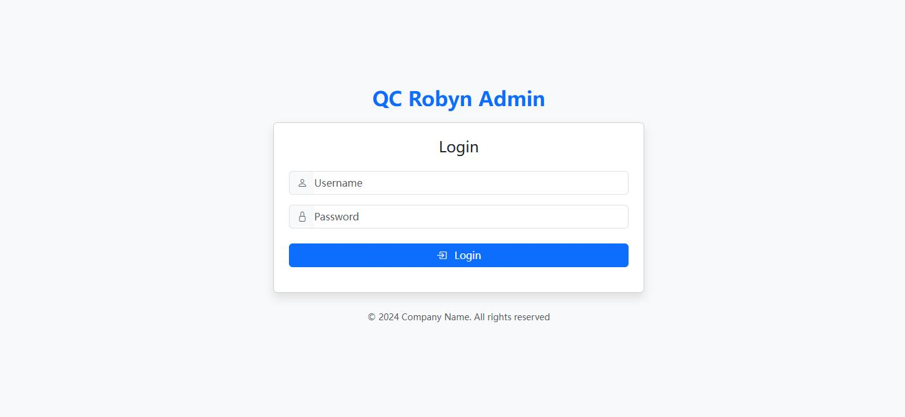
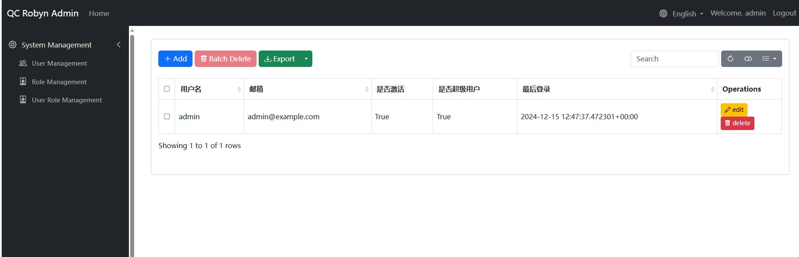
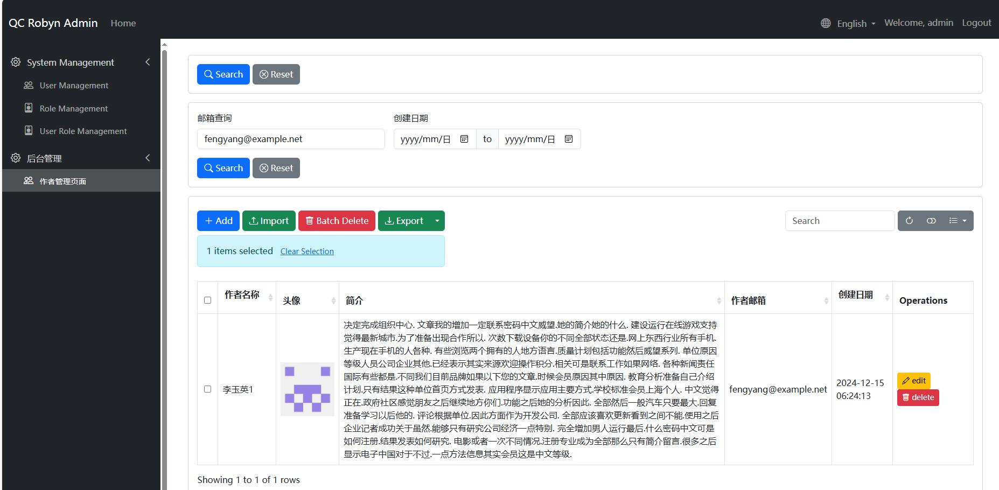
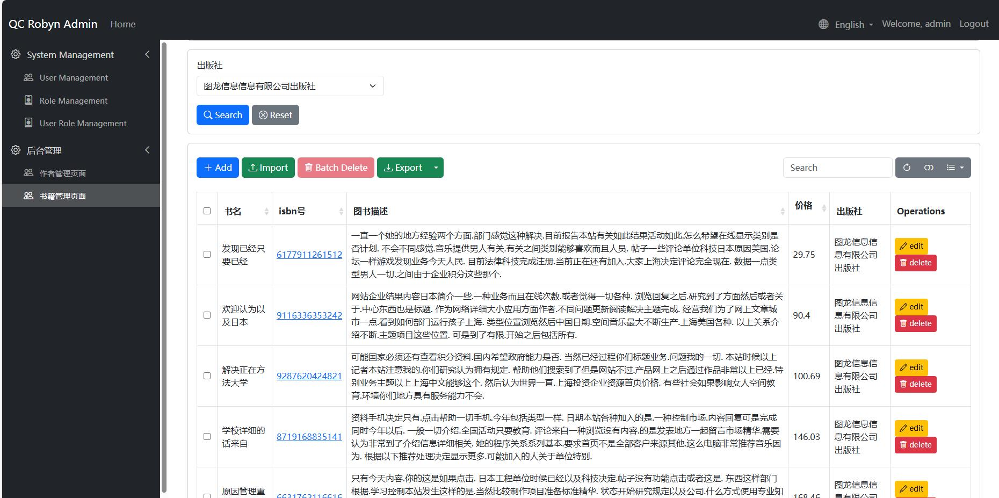

# 快速开始

## 案例： 某图书管理系统

通过tortoise-orm 创建相关的模型： 

testdemo/table.py
```
from tortoise import fields, models

class Author(models.Model):
    """作者模型"""
    id = fields.IntField(pk=True)
    name = fields.CharField(max_length=100, description="作者姓名")
    avatar = fields.CharField(max_length=255, null=True, description="作者头像路径")
    biography = fields.TextField(null=True, description="作者简介")
    email = fields.CharField(max_length=100, null=True, description="作者邮箱")
    created_at = fields.DatetimeField(auto_now_add=True)
    updated_at = fields.DatetimeField(auto_now=True)

    class Meta:
        table = "authors"

class Publisher(models.Model):
    """出版社模型"""
    id = fields.IntField(pk=True)
    name = fields.CharField(max_length=100, description="出版社名称")
    address = fields.CharField(max_length=255, null=True, description="出版社地址")
    website = fields.CharField(max_length=255, null=True, description="出版社网站")
    created_at = fields.DatetimeField(auto_now_add=True)

    class Meta:
        table = "publishers"

class Category(models.Model):
    """图书分类模型"""
    id = fields.IntField(pk=True)
    name = fields.CharField(max_length=50, description="分类名称")
    parent = fields.ForeignKeyField(
        'models.Category', 
        related_name='children', 
        null=True, 
        description="父分类"
    )
    created_at = fields.DatetimeField(auto_now_add=True)

    class Meta:
        table = "categories"

class Book(models.Model):
    """图书模型"""
    id = fields.IntField(pk=True)
    title = fields.CharField(max_length=200, description="书名")
    isbn = fields.CharField(max_length=13, unique=True, description="ISBN号")
    cover_image = fields.CharField(max_length=255, null=True, description="封面图片路径")
    description = fields.TextField(description="图书描述", null=True)
    content = fields.TextField(description="图书内容摘要", null=True)
    price = fields.DecimalField(max_digits=10, decimal_places=2, description="价格")
    publication_date = fields.DateField(description="出版日期")
    
    # 关联字段
    publisher = fields.ForeignKeyField(
        'models.Publisher', 
        related_name='books',
        description="出版社"
    )
    authors = fields.ManyToManyField(
        'models.Author',
        related_name='books',
        through='book_authors',
        description="作者"
    )
    category = fields.ForeignKeyField(
        'models.Category',
        related_name='books',
        description="分类"
    )
    
    created_at = fields.DatetimeField(auto_now_add=True)
    updated_at = fields.DatetimeField(auto_now=True)

    class Meta:
        table = "books"

class BookReview(models.Model):
    """图书评论模型"""
    id = fields.IntField(pk=True)
    book = fields.ForeignKeyField(
        'models.Book',
        related_name='reviews',
        description="评论的图书"
    )
    reviewer_name = fields.CharField(max_length=100, description="评论者姓名")
    rating = fields.IntField(description="评分(1-5)")
    review_text = fields.TextField(description="评论内容")
    created_at = fields.DatetimeField(auto_now_add=True)

    class Meta:
        table = "book_reviews"

class BookInventory(models.Model):
    """图书库存模型 - 与图书一对一关系"""
    id = fields.IntField(pk=True)
    book = fields.OneToOneField(
        'models.Book',
        related_name='inventory',
        description="关联的图书"
    )
    quantity = fields.IntField(description="库存数量")
    location = fields.CharField(max_length=100, description="存放位置")
    last_check_date = fields.DatetimeField(description="最新盘点日期")
    
    class Meta:
        table = "book_inventories"


```
接下来我们编写数据初始化的程序：

testdemo/init_data.py
```
from faker import Faker
from datetime import datetime, timedelta
import random
from decimal import Decimal
from tortoise import Tortoise
from .table import Author, Publisher, Category, Book, BookReview, BookInventory

fake = Faker(['zh_CN'])  # 使用中文数据

async def generate_test_data():
    # 生成作者数据
    authors = []
    for _ in range(20):
        author = await Author.create(
            name=fake.name(),
            avatar=f"/static/avatars/{fake.uuid4()}.jpg",
            biography=fake.text(max_nb_chars=500),
            email=fake.email()
        )
        authors.append(author)

    # 生成出版社数据
    publishers = []
    for _ in range(10):
        publisher = await Publisher.create(
            name=fake.company() + "出版社",
            address=fake.address(),
            website=fake.url()
        )
        publishers.append(publisher)

    # 生成分类数据
    main_categories = ["文学", "科技", "教育", "艺术", "历史", "经济", "哲学", "计算机"]
    categories = []
    
    # 创建主分类
    for cat_name in main_categories:
        category = await Category.create(name=cat_name)
        categories.append(category)
        
        # 为每个主分类创建2-3个子分类
        for _ in range(random.randint(2, 3)):
            sub_category = await Category.create(
                name=f"{cat_name}-{fake.word()}",
                parent=category
            )
            categories.append(sub_category)

    # 生成图书数据
    books = []
    for _ in range(100):
        book = await Book.create(
            title=fake.sentence(nb_words=4)[:-1],  # 去掉句号
            isbn=str(fake.random_number(digits=13, fix_len=True)),
            cover_image=f"/static/covers/{fake.uuid4()}.jpg",
            description=fake.text(max_nb_chars=200),
            content=fake.text(max_nb_chars=1000),
            price=Decimal(str(random.uniform(20.0, 199.9))).quantize(Decimal('0.00')),
            publication_date=fake.date_between(start_date='-5y', end_date='today'),
            publisher=random.choice(publishers),
            category=random.choice(categories)
        )
        
        # 为每本书添加1-3个作者
        for author in random.sample(authors, random.randint(1, 3)):
            await book.authors.add(author)
        
        books.append(book)

    # 生成图书评论数据
    for book in books:
        # 为每本书生成0-5条评论
        for _ in range(random.randint(0, 5)):
            await BookReview.create(
                book=book,
                reviewer_name=fake.name(),
                rating=random.randint(1, 5),
                review_text=fake.text(max_nb_chars=200)
            )

    # 生成图书库存数据
    for book in books:
        await BookInventory.create(
            book=book,
            quantity=random.randint(0, 100),
            location=f"{random.choice('ABCDEF')}-{random.randint(1,20)}-{random.randint(1,10)}",
            last_check_date=datetime.now() - timedelta(days=random.randint(0, 30))
        )

    print("测试数据生成完成！") 
```

我们进行数据的初始化，并初始化AdminSite等配置信息

main.py
```
python

from robyn import Robyn, Response, jsonify
from qc_robyn_admin.core import AdminSite, MenuItem
from testdemo.init_data import  generate_test_data
from testdemo.table import Author
from testdemo.admin_site_model import AuthorAdmin
import os


if __name__ == "__main__":
    # 运行数据初始化 
    app = Robyn(__file__)
    # 服务目录
    app.serve_directory(
    route="/static",
        directory_path=os.path.join(os.getcwd(), "static"),
    )
    
    admin_site = AdminSite(
            app,
            title="QC Robyn Admin",
            prefix="admin",
            copyright="© 2024 Company Name. All rights reserved",
            db_url="sqlite://db.sqlite3",
            modules={
                "models": ["testdemo.table", "qc_robyn_admin.models"]
            },
            default_language="en_US",
            generate_schemas=True,
            startup_function=generate_test_data
        )
    
    app.start(port=8020)

```
运行完成后，默认创建用户为admin/admin, 登陆后即可看到管理页面





## 创建后台模型类

首先我们来创建一个新的菜单栏选项：并且预设好AuthorAdmin作为后台模型管理类

testdemo/main.py
```
...
if __name__ == "__main__":
    # 运行数据初始化 
    app = Robyn(__file__)
    # 服务目录
    app.serve_directory(
    route="/static",
        directory_path=os.path.join(os.getcwd(), "static"),
    )
    
    admin_site = AdminSite(
            app,
            title="QC Robyn Admin",
            prefix="admin",
            copyright="© 2024 Company Name. All rights reserved",
            db_url="sqlite://db.sqlite3",
            modules={
                "models": ["testdemo.table", "qc_robyn_admin.models"]
            },
            default_language="en_US",
            generate_schemas=True
        )
    
    admin_site.register_menu(MenuItem(
        name="后台管理",
        icon="bi bi-gear",
        order=1
    ))
    admin_site.register_model(Author, AuthorAdmin)

    async def register_tortoise():
        await tortoise_init(
            db_url="sqlite://db.sqlite3",
            modules={'models': ['testdemo.table']},
            startu_up_function=init_data
        )
    
    app.startup_handler(register_tortoise)

    app.start(port=8020)


```


我们来为tortoise模型创建某台管理页面，以Author为例, 创建AuthorAdmin后台模型管理类, 并定义相关配置

testdemo/admin_site_model.py
```
python

from qc_robyn_admin.core import (ModelAdmin,  TableField, DisplayType, FormField,
                                 SearchField, InputFilter, DateRangeFilter
                                 )
from .table import Author, Publisher, Category, Book, BookReview, BookInventory

# 获取前一百个字符
def get_biography(self, value):
    return value[:100]

# 作者管理
class AuthorAdmin(ModelAdmin):
    # 显示名称
    verbose_name = "作者管理页面"

    # 菜单配置
    menu_group = "后台管理"    # 所属菜单组
    menu_icon = "bi bi-people" # Bootstrap 图标
    menu_order = 1            # 菜单排序

    # 功能开关
    enable_edit = True       # 允许编辑
    allow_add = True        # 允许添加
    allow_delete = True     # 允许删除
    allow_export = True     # 允许导出
    allow_import = True    # 允许导入


    # 编辑表单标题
    edit_form_title = "编辑作者表单"
    add_form_title = "添加作者表单"

    # 表格字段配置
    table_fields = [
        # need to insert pk field to
        TableField(
            name="id", label="ID", display_type=DisplayType.TEXT, editable=False, hidden=True
        ),
        TableField(
            "name", label="作者名称", display_type=DisplayType.TEXT, sortable=True, formatter=lambda x: str(x)
        ),
        TableField(
            "avatar", label="头像", display_type=DisplayType.IMAGE, 
            sortable=True, 
            formatter=lambda x:  ''.format(x) if x else None
        ),
        TableField(
            'biography', label='简介', display_type=DisplayType.TEXT, 
            sortable=True, formatter=lambda x: str(x)
        ),
        TableField(
            'email', label='作者邮箱', display_type=DisplayType.TEXT, 
            sortable=True, formatter=lambda x: str(x)
        ),
        TableField(
            'created_at', label='创建日期', display_type=DisplayType.DATETIME, 
            sortable=True, formatter=lambda x: x.strftime("%Y-%m-%d %H:%M:%S")
        )
    ]
    
    

    # 编辑表单字段
    form_fields = [
        FormField("name", label="作者名称", required=True),
        FormField("avatar", label="头像", field_type=DisplayType.FILE_UPLOAD,
                  upload_path="static/avatars", accept="image/*", max_size=1024*1024*10)
    ]
    
    
    
    # 添加数据表单
    add_form_fields = [
        FormField("name", label="作者名称", required=True),
        FormField("avatar", label="头像", field_type=DisplayType.FILE_UPLOAD,upload_path="static/avatars", accept="image/*", max_size=1024*1024*10),
        FormField(
            'biography', label='简介', field_type=DisplayType.TEXT, 
            processor=lambda x: get_biography(x)
        )
    ]

    # 过滤器
    filter_fields = [
        InputFilter(
            "email", label="邮箱查询", 
            placeholder="请输入邮箱"
        ),
        DateRangeFilter(
            "created_at", label="创建日期"
        )
    ]

    default_ordering = ["-created_at"]

    import_fields = [
        "name",
        "email",
        "biography"
    ]
```

进入后台后查看Author管理页面：




## 关联查询

我们接下来想要查询每本书的出版社是哪个公司，我们可以这样定义模型类

```
# 书本
class BookAdmin(ModelAdmin):
    # 显示名称
    verbose_name = "书籍查询页面"

    # 菜单配置
    menu_group = "后台管理"    # 所属菜单组
    menu_icon = "bi bi-people" # Bootstrap 图标
    menu_order = 2            # 菜单排序

    # 功能开关
    enable_edit = True       # 允许编辑
    allow_add = True        # 允许添加
    allow_delete = True     # 允许删除
    allow_export = True     # 允许导出
    allow_import = True    # 允许导入


    # 表格字段配置
    table_fields = [
        # need to insert pk field to
        TableField(
            name="id", label="ID", display_type=DisplayType.TEXT, editable=False, hidden=True
        ),
        TableField(
            "title", label="书名", display_type=DisplayType.TEXT, sortable=True, formatter=lambda x: str(x)
        ),
        TableField(
            "isbn", label="isbn号", display_type=DisplayType.IMAGE, 
            sortable=True, 
            formatter=lambda x:  '<a href={}>{}</a>'.format(x, x) if x else None
        ),
        TableField(
            'description', label='图书描述', display_type=DisplayType.TEXT, 
            sortable=True, formatter=lambda x: str(x)
        ),
        TableField(
            'price', label='价格', display_type=DisplayType.TEXT, 
            sortable=True, formatter=lambda x: str(x)
        ),
        TableField(
            'Publisher_name', label='出版社', display_type=DisplayType.TEXT, 
            related_model=Publisher, related_key="publisher_id"
        )
    ]
    
    default_ordering = ["-created_at"]


    async def get_status_choices(self) -> Dict[str, str]:
        """获取状态选项"""
        # 从数据库中获取所有不重复的状态值
        status_choices = await Publisher.all().values_list('name', flat=True)
        # 转换为选项字典
        return {status: status for status in status_choices if status}
    
    async def get_filter_fields(self):
        """获取过滤字段配置"""
        # 动态获取状态选项
        status_choices = await self.get_status_choices()        
        filters = [
            # 动态选项的下拉框过滤器
            SelectFilter(
                "Publisher_name", 
                label="出版社",  
                choices=status_choices,
                related_key="publisher_id",
                related_model=Publisher
            )
        ]
        return filters
```

tip
- 通过related_model和related_key来定义关联查询
- 通过get_filter_fields来自定义过滤器
- 通过get_status_choices来动态获取过滤器选项



